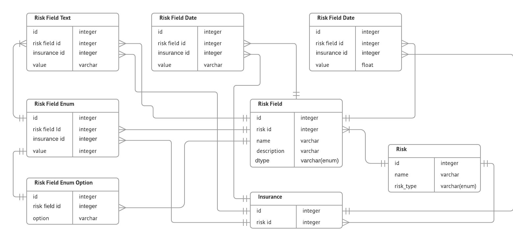

## Database Model
1. Risk - Table for each individual template
2. Insurance - Single Risk Template can have multiple insurance
3. RiskField - A Risk Template can have multiple fields of different type
4. RiskFieldEnumOption - Multiple Options for Field type Enum.
5. RiskFieldText - Stores data for an insurance for text fields
6. RiskFieldDate - Stores data for an insurance for date fields
7. RiskFieldNumber - Stores data for an insurance for number fields
8. RiskFieldEnum - Stores data for an insurance for enum fields

The ORM model class can be found [here](./risk_management/risk_type/models.py). 

The following ERD explains the relations better. 




## Backend Apis
The implementation can be found [here](./risk_management/risk_type/views.py)


### Get Individual Risk
Returns an Individual risk template based on risk id

#### End Point 
/get/risk/<risk-id>/. Risk Id (1-3) should work for testing.

#### Output 
```json
{"name": "Test Insurance", "id": 3, "fields": [{"name": "First Name", "description": "yes", "options": [], "dtype": "text"}, {"name": "Gender", "description": "yes", "options": [{"option": "Other"}, {"option": "Male"}, {"option": "Female"}], "dtype": "enum"}]}
``` 

### Get All Risks
Returns all risk templates

#### End Point
/get/risks/

#### Output
```json
[{"name": "Test", "id": 1, "fields": []}, {"name": "Test 2", "id": 2, "fields": [{"name": "First Name", "description": "yes", "options": [], "dtype": "text"}]}, {"name": "Test Insurance", "id": 3, "fields": [{"name": "First Name", "description": "yes", "options": [], "dtype": "text"}, {"name": "Gender", "description": "yes", "options": [{"option": "Other"}, {"option": "Male"}, {"option": "Female"}], "dtype": "enum"}]}]
```


## Frontend 

The frontend can be accessed at the path home path (i.e - /). For now hardcoded the template to Risk Id 3. It can be easily changed to a generic id.


## Deployment

Deployment is done to AWS ECS using Fargate. There is a script [deploy.sh](./deploy.sh) to take care of it. Its a simple script and self explanatory. The deployment would not work on any other PC as it requires my AWS Credentials. 

For now I've kept the Fargate task to have public ip. Ideally should have configured a Load Balancer before that. 


## Database 
For simplicity I've used sqlite3. It can be easily changed to Postgresql or MySql or any other supported by django. 